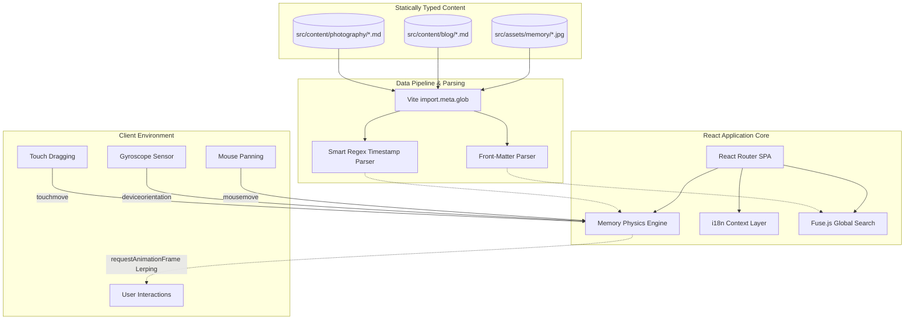

# Architecture Specification: My Blog Vibe

## 1. Overview
This project is a high-performance, single-page application (SPA) portfolio and blog. It serves as an interactive showcase, blending standard content management with highly immersive, mathematically-driven graphical experiences.

### High-Level Architecture Flow

## 2. Technology Stack
- **Core:** React (Vite build system)
- **Routing:** React Router v6
- **Styling:** Vanilla CSS (Hardware/GPU accelerated transitions)
- **Content Management:** Markdown (`.md` files) parsed via `front-matter`
- **Asset Pipeline:** Vite `import.meta.glob` (Static Eager Initialization)
- **Search Engine:** Fuse.js (Typo-tolerant fuzzy searching)
- **Testing:** Vitest + React Testing Library

## 3. Data Flow & Content Pipeline
Instead of relying on a traditional headless CMS or database, the architecture is entirely static and strictly self-contained using **Vite Globbing**:
- **Blog & Case Studies:** Curated inside `src/content/blog` as `.md` files. They contain YAML frontmatter for metadata (title, dates, tags) and Markdown for string bodies, fetched immediately into the Vite build step.
- **Dynamic Asset Injection:** The Memory gallery specifically tracks unstructured media (`.jpg`, `.png`, `.heic`). The pipeline automatically transpiles 13-digit Unix Timestamps and proprietary camera signatures (`PXL_`, `IMG_`) into parseable human-readable titles without explicit database entries.

## 4. Key Systems & Modules

### A. The "Memory" Physics Engine (`Memory.jsx`)
The centerpiece of the application is a deeply integrated physics loop designed to circumvent typical React rendering boundaries.
- **Game-Loop Rendering:** Moving the mouse does not re-render the DOM via React state. Instead, mouse inputs merely assign vector coordinates to a mutable `useRef()`. A standalone `requestAnimationFrame` loop mathematically lerps (Linear Interpolation) the space container towards that target at 60fps.
- **Hardware-Integrated Sensors:** On mobile devices, `DeviceOrientationEvent` actively binds to the smartphone's physical gyroscope, normalizing `alpha/beta/gamma` orientation into the exact same X/Y vectors used for mouse panning.
- **Jittered Grid Distribution:** To prevent algorithmic overlapping of randomized elements, coordinates map onto an invisible mathematical grid. Each image is assigned a unique sector and permitted controlled pseudo-random "jitter", guaranteeing organic scatter with impenetrable boundaries.
- **Scraping Defenses:** Incorporates transient `<meta name="robots">` header injections alongside native pointer manipulation (`WebkitUserDrag: none`) to restrict web-scrapers and localized copying of personal assets.

### B. Internationalization (i18n)
Full localization infrastructure explicitly segregates context logic to support language pivoting between EN (English) and JP (Japanese). 

### C. Search & Navigation
A decoupled search infrastructure leveraging `Fuse.js` builds indexed maps of all `.md` front-matter attributes, providing predictive text formatting across deeply nested content silos.

## 5. Security & Deployment
The repository is continuously integrated against Vercel. 
During the build phase, Vite aggregates and minifies CSS dependencies and transpiles JSX into isolated chunks, securely stripping out testing layers (`coverage/`) and mapping static paths so that the `import.meta.glob` references resolve correctly on Vercel's global CDN edges.
